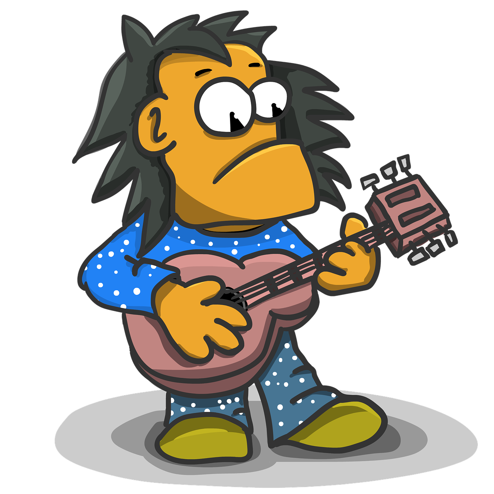

# Guitar-Hero-Easy-Mode

</img> Simple scripts for a simple prototype of a guitar hero android clone for Unity

# How to use:
<ol>
<li>Download the scripts.</li>
<li>Add to Unity Project.</li>
<li>Create Dots Gameobjects as prefabs and add to them the dots script and the rigidbody2D component as kinematic.</li>
<li>Create two empty objects for the Buttons Manager and the Random Dots Spawner and setup with what makes best for your game.</li>
<li>Create the buttons, add a trigger box collider</li>
</ol>
